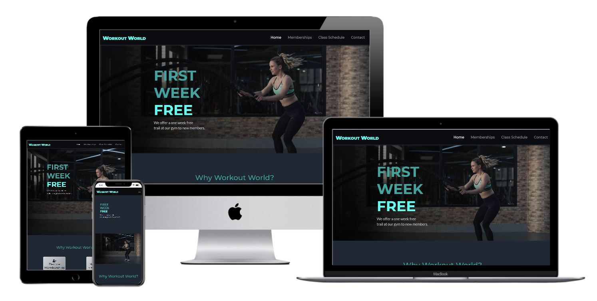
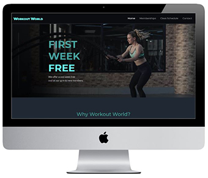
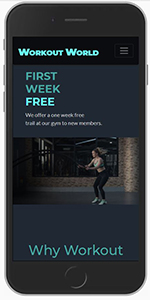
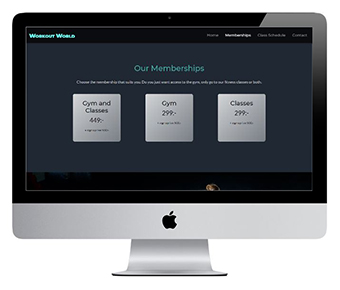
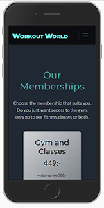
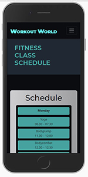
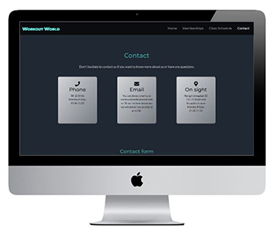
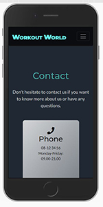

# Workout World

[Link to the website](https://marialundgren.github.io/workout-world/)

This website is created for the new gym Workout World in the center of Stockholm in Sweden. The main objective of the website is to create a presence on internet
for the gym and to inform about the gym to new and existing members.
The project is fictional and created for educational purpose.

## UX 
In this section is the explanation of how the website is planned to make it usable and valuable for both the user and site owner using the five planes of user experience. 
### 1 Strategy
The objective of this website is to inform about the gym and its offer to new and existing members. 
The target audience for the gym is people living in Stockholm who wants to workout at a modern and friendly gym. 
The user on the website is always going to be an anonymous user since it is not possible to log in to the website yet. 

Users goal: wants to know more about the gym and what it offers.

Site owners' goal: to create an online presence of the gym and to inform about what the gym offers. 

#### User stories 
* As a user, I want to know what type of memberships the gym offers. 
* As a user, I want to know what a membership costs.
* As a user, I want to find out how to contact the gym. 
* As a user, I what to see what classes the gym offers. 
* As a user, I want to find out when the classes are available. 
* As a user, I what to know what opening hour the gym has. 
* As a user, I what to know where the gym is located. 

### 2 Scope 
The focus of the website is for new and existing members to easily find information about the gym, its offer and how to get in contact with the personnel at the gym. 
Since it is a b2c website it is important to have easy digestible content on the site and this has been taken into consideration when building the site, 
by haveing big pictures and small sections with text to make it easier for the user. 
### 3 Structure 
The structure of the page is designed with a linear narrative to make the site easy to navigate from the first time visiting it.
The navigation bar is placed at the top of the browser window and is sticky so that it is easy to go where you want on the website.
On the landing page of the site more general information represented and then you can move on to more detailed information on the other sides of the webpage. 
### 4 Skeleton
Wireframes were developed for the website to ensure that the content is presented in line with the strategy and goal of the website and to make sure that the arrangement amongst the elements work. 
Visual metaphors in the form of icons are used in some places to make the content easier to interpret for the user. 
For the structure, the more general information and perks of the gym is represented because this content is prioritized to get users interested. When you continue the navbar 
to the right more detail information is presented first for those who are interested and furthest to the right in the navbar the contact page is placed. 

Balsamiq was used to create wireframe for the website, the wireframes are linked below. 
* [Desktop](wireframes/desktop-wireframes.pdf) 
* [Tablet](wireframes/tablet-wireframes.pdf) 
* [Mobile](wireframes/phone-wireframes.pdf) 

### 5 Surface

#### Color

The color scheme used for this project is to create a minimalistic and modern design with high contrast between the lighter and the darker colors.
The two darkest color are used as background colors for the project and the lighter gray and darker turquoise are used for text and elements in the project. 
The lightest turquoise are used sparingly to hightlight some elements in the project.

#### Typography 
The fonts used in this project are both found on google fonts, Montserrat is used for the headings paired with the font Lato for body text which was a popular pairing suggested by google fonts.
The fallback font for both headings and body text is Sans-Serif. 

## Features 
Here the features of the project is explaned and some features that could be implemented in the future to the project. 
### Existing Features
- Navbar
    - The navbar will be sticky so that the user always can easily get to different parts of the webpage 
    and become a dropdown menu on tablet and phone. 
- Footer 
    - The footer will contain links to social media so the user can easily fin the gym on social media 
    and the gym logo. 
- Home
    - Navbar (described under navbar)
    - The homepage will have a hero image underneath the navbar with an offer on it to get the users attention. 
    - Underneath the hero image on the homepage some of the benefits with the gym will be presented 
    to immediately let the user knows some of the advantages of the gym. 
    - Footer (described under footer).
- Memberships
    - Navbar (described under navbar). 
    - On the membership page the three different memberships will be presented so that the user know what memberships are avalibe and their prices. 
    - Underneath the memberships on the membership page there will be a picture where the student discount is presented 
    so that the users that are students know they can get a discount on the memberships.
    - Footer (described under footer).
- Class Schedule
    - Navbar (described under navbar).
    - On the Class schedule page underneath the navbar there will be a hero image with the text fitness class schedule on it. 
    - Underneath the hero image on the class schedule page the schedule for the classes will be so the user can see when the classes take place. 
    - Underneath the schedule for the classes the instructors will be shortly presented so that the user can get to know the different instructors a little. 
    - Footer (described under footer).
- Contact
    - Navbar (described under navbar).
    - On the contact page under the navbar the different ways to contact the gym will be presented so that the user knows the different ways they can get in contact with the gym. 
    - Underneath the different ways to contact the gym there will be a contact form if the user wants to fill that out instead of using some of the other ways to contact the gym. 
      When pressing the submit button the page will reload.  
    - Footer (described under footer).

### Features Left to Implement
* A way to sign up to become a member on the website.
* Link pictures from the gym's Instagram on the website. 
* A google maps to see where the gym is located.

## Technologies Used
* [HTML5](https://en.wikipedia.org/wiki/HTML5) used as the main programming language. 
* [CSS](https://en.wikipedia.org/wiki/CSS) used to add style to the project. 
* [Bootstrap](https://getbootstrap.com/) used to style some elements and to make the website responsive. 
* [Font Awesome](https://fontawesome.com/) used for the icons. 
* [Google Fonts](https://fonts.google.com/) used to import the two fonts that I used in the project, Montserrat and Latol. 
* [Gitpod](https://www.gitpod.io/) used to develop the project.  
* [Github](https://github.com/) used to store the project. 
* [Balsamiq](https://balsamiq.com/) used to create the wireframes. 
* [TinyJPG](https://tinyjpg.com/) used to compress images. 
* [Photoshop](https://www.adobe.com/se/products/photoshop.html?sdid=8JD95K3Z&mv=search&ef_id=eca789e041d41a016e7ae9d20a38c22d:G:s&s_kwcid=AL!3085!10!79577224923347!79577349402192&msclkid=eca789e041d41a016e7ae9d20a38c22d) was used to edit some of the images. 

## Testing

### Validation 
* To test the HTML I used the [W3C Markup validation Service.](https://validator.w3.org/)
At first the was a warning message because I had put the logo as a H1.
I made some research, and it seems that the best is to not use the logo as a h1 especially since 
I have a logo at the bottom and the top of every page and you should only use one h1 per page. 
After I changed this there was no errors or warning to show. 
* To test the CSS I used the [W3D CSS Validation Service.]https://jigsaw.w3.org/css-validator/
There were no errors in the CSS-code and the code vas validated at CSS level 3 + SVG. 

### Features
Below the user stories testing are presented and the manual testing for interactive elemenmts. 
#### Navbar
Manual testing of the navbar.
* Clicking the logo reloads the home page.
* Clicking the home link reloads the home page.
* Clicking the memberships link brings user to the membership page. 
* Clicking the class schedule link brings user to the class schedule page. 
* Clicking the contact link brings user to the contact page.
* Hovering over the links to make sure they become lighter when hovering over them. 
* Scrolling down the page the navbar stays at the top of the browser window. 
* This was repeated on all pages to make sure the navbar works on every page.
#### Footer 
- As a user, I want to find out how to contact the gym.
    - In the footer there are links to the gyms social media if the user wants to connect with the gym there. 

Manual testing of the footer.
* Clicking the logo reloads the home page. 
* Clicking the Facebook icon brings user to facebook.com in a new browser window. 
* Clicking the Instagram icon brings user to instagram.com in a new browser window. 
* Clicking the Linkedin icon brings user to linkedin.com in a new browser window.
* Hovering over the contact link and social icons to make sure they become lighter when hovering over them.
* This is repeated on all pages to make sure the footer works on every page. 
#### Home 
- As a user, I want to know what a membership cost.
    - On the home page you can see that new members can try out the gym for one week free of charge.
- As a user, I what to know what opening hour the gym has.
    - On the home page you can see under the Why Workout World? heading that the gym always is open.

 
#### Memberships 
- As a user, I want to know what type of memberships the gym offers.
    - At the memberships page the user can see the three different memberships that the gym offers under Our memberships.
- As a user, I want to know what a membership cost.
    - At the memberships page the user can see under Our Memberships what the prices of the different memberships are and the sign-up fee. On the same page there is also underneath the membership's information about student discount so that the users that are students can know that the gym offers 15% student discount on all memberships. 

 
#### Class Schedule 
- As a user, I what to see what classes the gym offers.
    - On the class schedule page, the user can find a schedule of the classes the gym offers in the schedule. 
- As a user, I want to find out when the classes are available.
    - On the class schedule page, the user can also find out when the different classes are held in the schedule. 

 
#### Contact 
- As a user, I want to find out how to contact the gym.
    - On the contact page the user can find all the ways they can contact the gym, on phone, email, on sight and via a contact form.
- As a user, I what to know what opening hour the gym has.
    - On the contact page the opening hours for the reception is stated so the user knows when they can visit the reception or call the gym.
- As a user, I what to know where the gym is located.
    - Under the contact page you can see the address to the gym under Contact and on sight.

Manual testing of the contact form.
* Go to the contact page. 
* Trying to submit the form empty and an error message appears to fill out required fields. 
* Trying to submit the form without a valid email address and an error message appears. 
* Trying to submit the form with all the required information and the page reloads.

  

### Responsiveness
The responsiveness was tested using Chrome and Mozilla Firefox DevTools. 

The responsiveness is tested on these devices with Chrome DevTools: 
*	Moto 4
*	Galaxy S5
*	Pixel 2
*	Pixel 2 XL
*	iPhone 5/SE
*	iPhone 6/7/8
*	iPhone 6/7/8 Plus 
*	iPhone X
*	iPad 
*	iPad Pro 
*	Surface Duo
*	Galaxy Fold 

The responsiveness is tested on these devices with Mozilla Firefox DevTools: 
*	Galaxy S9/S9+
*	iPad
*	iPhone 6/7/8
*	iPhone 6/7/8 Plus 
*	iPhone X/XS
*	Kindle Fire HDX

Changes done to make the webpage responsive on all devices tested: 
*	Changed the schedule from having its breakpoint to col-xl from col-lg because otherwise on iPad Pro Sunday in the schedule dropped down below 
the other days of the week and stretched the whole width of the screen.
* Changed the reasons section on the homepage from col-lg-3 to col-xl-3, this was made because otherwise the reasons section
didn't look good at the ipad pro where it was to thight to fit all the items in this section in the same row.  
*	Changed the padding of the social media icons in the footer because other wide they didn’t fit on the same line on the iPad and Galaxy Fold. 
*	Put in a media query for the logo on screen sizes with a wax width of 320px to make the logo smaller because otherwise the logo and navigation
 menu didn’t fit on the same line and dropped down below the logo instead. 
* Added a media query on screen sizes with a wax width of 320px for the heading for our memberships section to make the heading smaller because it went outside the screen on the Galaxy Fold.  

### Browsers 
The webpage is tested on Google Chrome, Mozilla Firefox, Microsoft Edge and Safari.

The website don't support Internet Explorer. 

### Performance with lighthouse
To test the performance of the project I used Lighthouse.
The first times that I used lighthouse the performace of the pages wasn't that good, to fix this I compressed the images that I used 
because the file sizes were pretty big, I also squared the images used for the instructors in Photoshop to make the performance better. 
The SEO is also improved by adding a meta description to all the pages. 

The Lighthouse scores are first presented for desktop for each page and the second one is for mobile. 
#### Home page

#### Memberships page 

#### Class Schedule page 

#### Contact page 

### Bugs 
#### Fixed bugs
* A white space on the screen to the right of everything but the navbar on Moto G4, Glaxy S5 pixel 2, pixel 2 XL iPhone 5/SE, iPhone 6/7/8, iPhone X, Galaxy Fold, Surface duo in Chrome DevTools, that disappears after pressing something on the screen.
  After googling this problem I started with checking that I didn't have any elements that was exceeding more than 100% of the screen width. I couldn't find any so I inserted overflow-x: hidden for html and body
  in my CSS file that I found in [this](https://stackoverflow.com/questions/46012482/unwanted-white-space-on-right-side-in-mobile-view/46012924) thread on Stack Overflow that fixed the problem.
* Images don't work when deploying the website on Github. Fixed this by changing the image file paths from absolute to relative instead. 
It seems like the problem could have appeared because Github don’t like absolute file paths but they worked on Gitpod so I hadn’t notice the problem before deploying the project to Github. 

#### Open bugs
* Hero images on Class Schedule page, home page and the student discount picture get a bit squashed together in their container 
instead of being cropped by the container and the overflow hidden on Internet Explorer.  
 
## Deployment
### Deploy 
1. Log in to your Github account. 
2. Find the desired repository and click on it.
3. In the toolbar click on Settings. 
4. Scroll down until you get to GitHub Pages. 
5. Select the branch master and click save. 
6. The link is now available under GitHub Pages in the high-lighted green area. 
7. When clicking on the link you will access the website. 
### Run code locally
1. Find the repository and click on it.
2. Above all the files click on the green gitpod button. 
3. This opens a new copy of the workspace at github, this should onely be done once and then you can access the workspace from gitpod. 
If you press this button again it will create a new copy of the workspace on gitpod. 
4. The workspace can now be edited locally.
5. To open a prewiev of the workspace in a full browser window, in the terminal window type in the command: python3 -m http.server, an click open browser in the pop-up window down to the right. 

## Credits 

### Code 
Most of the code in this project was written by me, however some smaller pieces of code I got from other, these are presented below. 
* The navbar is taken from bootstrap and customized to fit my project. 
* Bootstrap is used to make the content responsive and to style some elements. 
* In my CSS file I used a piece of code found in [this](https://stackoverflow.com/questions/46012482/unwanted-white-space-on-right-side-in-mobile-view/46012924) thread on Stack Overflow to fix a layout problem on smaller screen sizes, this is described in more detail in the bugs section. 
* I used a piece of code from [this](https://www.youtube.com/watch?v=O7WbVj5apxU&t=583s) YouTube video made by Dev Ed to set the background on some items on the website, there are comment in the code in the regarding places. 

### Media 
* Hero image on home page by [Li Sun](https://www.pexels.com/@823sl) from [pexels](https://www.pexels.com/) 
* Student discount picture on memberships page by [Ivan Samkov](https://www.pexels.com/@ivan-samkov) from [pexels](https://www.pexels.com/) 
* Hero image on class schedule page by [Victor Freitas](https://www.pexels.com/@victorfreitas) from [pexels](https://www.pexels.com/) 
* Picture of the instructor Anna on class schedule page by [Leah Kelley](https://www.pexels.com/@leah-kelley-50725) from [pexels](https://www.pexels.com/)
* Picture of the instructor Kalle on class schedule page by [Elle Hughes](https://www.pexels.com/@elletakesphotos) from [pexels](https://www.pexels.com/)
* Picture of the instructor Philip on class schedule page by [Laker](https://www.pexels.com/@laker) from [pexels](https://www.pexels.com/)

### Acknowledgements 
* Code Institutes Slack community has been a extremly valiable resourse buring this project
where I have found the awnsers to numerous questions and problems that I have had. 
* I would also like to thank my mentor Rohit Sharma for his advice and guidence in this project.  